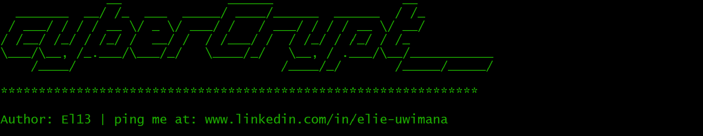

# CyberCrypt



## 📜 Description

💡CyberCrypt💡 is a command‑line cybersecurity tool designed for ethical hackers and penetration testers. It aims to deliver secure data transformation, robust hashing operations, and encryption algorithms (AES and RSA). it supports a comprehensive range of operations, including encoding, decoding, hashing, and unhashing. It supports all operating systems (Linux, Windows, and MacOs)

## ⚙️ Installation

### Prerequisites
- Python 3.6 or higher

### Installation Steps

#### Option 1: Install On Windows Os:
1. Clone the repository: 
```shell
git clone https://github.com/UwimanaMuhiziElie/cybercrypt.git
```
2. Navigate to the project directory: 
```shell
cd cybercrypt
```
3. Install CyberCrypt: 
```shell
python setup.py install
```

#### Option 2: Install on Linux (Kali Linux, Ubuntu tested):
1. Clone the repository: 
```shell
git clone https://github.com/UwimanaMuhiziElie/cybercrypt.git
```
2. Navigate to the project directory: 
```shell
cd cybercrypt
```
3. - Install all Requirements and packages:
```shell
pip install --user .
```
   - Or with `sudo` for system-wide installation: 
   ```shell
  pip install --user .
  ```
4. Test the tool: 
```shell
python cybercrypt.py --help
```
#### Option 3: Install on MacOs:
1. Install Homebrew (if not already installed):
```bash 
/bin/bash -c "$(curl -fsSL https://raw.githubusercontent.com/Homebrew/install/HEAD/install.sh)"
```
2. Install python 3 and pip: 
```shell 
brew install python
```
3. Clone the repository: 
```shell
git clone https://github.com/UwimanaMuhiziElie/cybercrypt.git
```
4. Navigate to the project directory: 
```shell
cd cybercrypt
```
5. Install Dependencies Using pip:
   ```shell
  pip install --user .
  ```
6. Test the tool: 
```shell
python cybercrypt.py --help
```

## 🚀 Usage
- For usage instructions, run:
```shell
$ python cybercrypt.py --help
              __              ______                 __
  _______  __/ /_  ___  _____/ ____/______  ______  / /_
 / ___/ / / / __ \/ _ \/ ___/ /   / ___/ / / / __ \/ __/
/ /__/ /_/ / /_/ /  __/ /  / /___/ /  / /_/ / /_/ / /_
\___/\__, /_.___/\___/_/   \____/_/   \__, / .___/\__/___________
    /____/                           /____/_/       /_____/_____/

***************************************************************

Author: El13 | ping me at: www.linkedin.com/in/elie-uwimana

usage: cyberCrypt.py <data> [OPTIONS] <Arguments>

CyberCrypt is a versatile command-line tool designed for secure data transformation, encryption, and hashing operations.

positional arguments:
  data                  Input data to process

optional arguments:
  -h, --help            show this help message and exit
  --generate-rsa-keypair
                        Generate RSA key pair (public and private key)
  --key-size {2048,3072,4096}
                        Specify RSA key size (default: 2048)
  --passphrase PASSPHRASE
                        Passphrase for RSA key pair encryption
  -enc {base64,hex,url,html}, --encode {base64,hex,url,html}
                        Encode the input data using specified algorithm (default: base64)
  -dec {base64,hex,url,html}, --decode {base64,hex,url,html}
                        Decode the input data using specified algorithm (default: base64)
  -hash {md5,sha1,sha256,sha512,sha3_256,bcrypt}, --hash {md5,sha1,sha256,sha512,sha3_256,bcrypt}
                        Hash the input data using specified algorithm (default: sha256)
  --concurrent-hash     Enable concurrent hashing
  -w WORDLIST, --wordlist WORDLIST
                        Path to a wordlist for unhashing
  --rsa-encrypt         Encrypt data using RSA (requires --public-key)
  --rsa-decrypt         Decrypt data using RSA (requires --private-key)
  --public-key PUBLIC_KEY
                        Path to RSA public key (for encryption)
  --private-key PRIVATE_KEY
                        Path to RSA private key (for decryption)
  --padding {OAEP,PKCS1v15}
                        Specify padding scheme for RSA operations (default: OAEP)
  --wrap-key            Wrap a symmetric key
  --unwrap-key          Unwrap a symmetric key
  --wrapping-key WRAPPING_KEY
                        Path to the key used for wrapping/unwrapping
  --key-to-wrap KEY_TO_WRAP
                        The key to be wrapped (in hex format)
  --wrapped-key WRAPPED_KEY
                        The wrapped key (in hex format)
  -v, --verbose         Enable verbose mode, providing detailed output
  --version             show program version number and exit

For more information, visit https://github.com/uwimanaMuhiziElie/cyberCrypt

```

#### Using a Virtual Environment(linux or macos):
1. Create a virtual Environment: 
```shell
python3 -m venv venv
```
2. Activate the Virtual Environment:
```shell
source venv/bin/activate
```
 
3. Install the package in the Virtual Environment:
```shell
pip install . or pip install --user . or sudo pip install .
```

## Examples
- **Encrypt data using base64**: 
  - Demonstration: This command will encode the string "hello world" using the base64 algorithm.
  - Example:
  ```shell
python cybercrypt.py "hello world" --encode base64
  ```
- **Decrypt data using base64**: 
  - Demonstration: This command will decode the base64-encoded string "aGVsbG8gd29ybGQ=".
  - Example:
  ```shell
python cybercrypt.py "aGVsbG8gd29ybGQ=" --decode base64
  ```
- **Hash data using sha256**:
  - Demonstration: This command will hash the string "password123" using the SHA-256 algorithm.
  - Example:
  ```shell
python cybercrypt.py "password123" --hash sha256
  ```
- **Unhash data with wordlist using md5**:
  - Demonstration: This command will attempt to unhash the MD5 hash <hashed_data> using words from the wordlist file.
  - Example:
  ```shell 
  python cybercrypt.py "5e884898da28047151d0e56f8dc6292773603d0d6aabbdd62a11ef721d1542d8" --unhash md5 --wordlist wordlist.txt
  ```
- **Generating RSA-key-pair**:
  - Demonstration: This command will generate a RSA key pair (public and private keys).
  - Example: `python cybercrypt.py --generate-rsa-keypair --key-size 2048 --passphrase "we are hackers!"`

- **RSA encryption**:
  - Demonstration: This command will encrypt the string "secret message" using RSA encryption and the specified public key.
  - Example: `python cybercrypt.py "secret message" --rsa-encrypt --public-key rsa_public.pem`

- **RSA decryption**:
  - Demonstration: This command will decrypt the RSA-encrypted data using the specified private key.
  - Example: 
  ```shell
python cybercrypt.py <encrypted_data> --rsa-decrypt --private-key rsa_private.pem --passphrase "we are hackers!"
  ```

- **AES encryption**:
  - Demonstration: This command will encrypt the string "secret message" using AES encryption and the specified key file.
  - Example: `python cybercrypt.py "secret message" --aes-encrypt --key-file aes_key.bin`

- **AES decryption**:
  - Demonstration: This command will decrypt the AES-encrypted data using the specified key file.
  - Example:
  ```shell
python cybercrypt.py <encrypted_data> --aes-decrypt --key-file aes_key.bin

  ```
## 📌 Author

### Elie Uwimana 😎
- [LinkedIn](www.linkedin.com/in/elie-uwimana)

## 🛠️ Troubleshooting
- If you encounter any issues, please [open an issue](https://github.com/UwimanaMuhiziElie/cybercrypt/issues) on GitHub.

## 📄 License
This project is licensed under the MIT License - see the [LICENSE](LICENSE) file for details.

## 📚 References

- [UNDERSTANDING DATA ENCRYPTION: A Practical Guide to Secure Computing](https://www.amazon.com/dp/B0D1TLTZ98/ref=sspa_dk_detail_2?psc=1&pd_rd_i=B0D1TLTZ98&pd_rd_w=JQkaA&content-id=amzn1.sym.7446a9d1-25fe-4460-b135-a60336bad2c9&pf_rd_p=7446a9d1-25fe-4460-b135-a60336bad2c9&pf_rd_r=SWTRAAGWVQ6HQWNCC9XC&pd_rd_wg=qoc1p&pd_rd_r=bd3942c5-8738-4299-843d-a53fc174c4f7&s=books&sp_csd=d2lkZ2V0TmFtZT1zcF9kZXRhaWw)
- [Serious Cryptography: A Practical Introduction to Modern Encryption](https://www.amazon.com/Serious-Cryptography-Practical-Introduction-Encryption/dp/1593278268?dplnkId=04c0f7fd-313d-4445-8d85-cd3ba4fa2511&nodl=1)
- [HackerOne](https://hackerone.com/)
- [OpenAI](https://openai.com/)